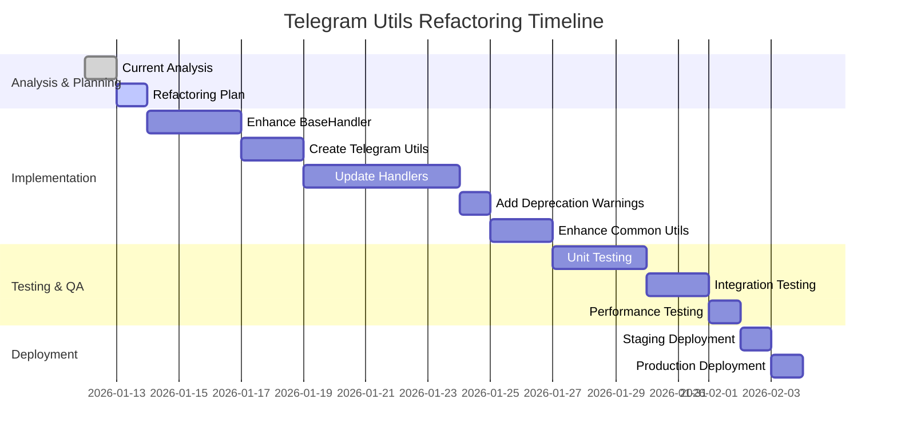

# Telegram Utils Refactoring Plan

## 📋 Executive Summary

This plan outlines the refactoring of `utils/telegram_utils.py` to integrate with the new `telegram_bot/common` structure while maintaining backward compatibility and following clean code principles.

## 🔍 Current Analysis

### 1. Current Usage Patterns

From analyzing the handlers, I identified the following usage patterns:

**Most Frequently Used Methods:**
- `safe_edit_message()` - Used in 90% of callback handlers (20+ occurrences)
- `safe_answer_query()` - Used in 85% of callback handlers (18+ occurrences)
- `get_user_id()` and `get_chat_id()` - Used in various handlers
- `handle_generic_error()` - Used for error handling
- `validate_callback_query()` - Used for callback validation

**Current Import Pattern:**
```python
from utils.telegram_utils import TelegramHandlerUtils
```

### 2. Integration with New Structure

The new `telegram_bot/common` structure provides:
- `BaseHandler` class with common functionality
- `CommonMessages` for standardized messages
- `CommonKeyboards` for navigation
- `decorators.py` for common patterns
- `utils.py` for general utilities

### 3. Key Findings

- **High Coupling**: Current handlers directly depend on `TelegramHandlerUtils`
- **Redundancy**: `BaseHandler` already uses `TelegramHandlerUtils` internally
- **Inconsistency**: Some handlers use direct Telegram API calls, others use utils
- **Missing Features**: No callback validation in `BaseHandler`

## 🎯 Refactoring Goals

1. **Respect Hybrid Hexagonal/Future-based Architecture**
2. **Follow SOLID Principles**
3. **Maintain Backward Compatibility**
4. **Leverage New Common Components**
5. **Reduce Code Duplication**

## 🏗️ Refactoring Plan

### Phase 1: Enhance BaseHandler (2-3 days)

**Objective**: Move Telegram-specific utilities into `BaseHandler` to reduce direct dependency on `TelegramHandlerUtils`.

**Changes:**

1. **Add Telegram-specific methods to BaseHandler**:
```python
# In telegram_bot/common/base_handler.py

async def _safe_edit_message(self, query, context, text, reply_markup=None, parse_mode="Markdown"):
    """Wrapper for safe_edit_message using TelegramHandlerUtils"""
    return await TelegramHandlerUtils.safe_edit_message(query, context, text, reply_markup, parse_mode)

async def _safe_answer_query(self, query):
    """Wrapper for safe_answer_query using TelegramHandlerUtils"""
    return await TelegramHandlerUtils.safe_answer_query(query)

def _get_user_id(self, update):
    """Wrapper for get_user_id using TelegramHandlerUtils"""
    return TelegramHandlerUtils.get_user_id(update)

def _get_chat_id(self, update):
    """Wrapper for get_chat_id using TelegramHandlerUtils"""
    return TelegramHandlerUtils.get_chat_id(update)
```

2. **Add callback validation to BaseHandler**:
```python
async def _validate_callback_query(self, query, context, update):
    """Validate callback query and handle errors"""
    return await TelegramHandlerUtils.validate_callback_query(query, context, update)
```

### Phase 2: Create Telegram-Specific Utilities (1-2 days)

**Objective**: Create a new `telegram_bot/common/telegram_utils.py` for Telegram-specific utilities.

**New File Structure:**
```python
# telegram_bot/common/telegram_utils.py

from telegram import Update
from telegram.ext import ContextTypes
from telegram.error import BadRequest
from utils.logger import logger
from .messages import CommonMessages
from .keyboards import CommonKeyboards

class TelegramUtils:
    """Telegram-specific utilities for handlers."""
    
    @staticmethod
    async def safe_edit_message(query, context, text, reply_markup=None, parse_mode=None):
        """Safely edit message with multiple fallback strategies."""
        # Current implementation from TelegramHandlerUtils
        
    @staticmethod
    async def safe_answer_query(query):
        """Safely answer callback query."""
        # Current implementation from TelegramHandlerUtils
        
    @staticmethod
    def get_user_id(update):
        """Get user ID from update."""
        # Current implementation from TelegramHandlerUtils
        
    @staticmethod
    def get_chat_id(update):
        """Get chat ID from update."""
        # Current implementation from TelegramHandlerUtils
        
    @staticmethod
    async def validate_callback_query(query, context, update):
        """Validate callback query."""
        # Current implementation from TelegramHandlerUtils
        
    @staticmethod
    async def handle_generic_error(context, update, error, custom_message=None):
        """Handle generic errors."""
        # Current implementation from TelegramHandlerUtils
```

### Phase 3: Update Handlers (3-5 days)

**Objective**: Migrate handlers to use `BaseHandler` methods instead of direct `TelegramHandlerUtils` calls.

**Migration Strategy:**

1. **Update imports**:
```python
# Old
from utils.telegram_utils import TelegramHandlerUtils

# New
from telegram_bot.common.base_handler import BaseHandler
from telegram_bot.common.telegram_utils import TelegramUtils
```

2. **Update handler classes to inherit from BaseHandler**:
```python
# Old
class AdminHandler:
    def __init__(self, admin_service):
        self.admin_service = admin_service

# New
class AdminHandler(BaseHandler):
    def __init__(self, admin_service):
        super().__init__(admin_service, "AdminService")
```

3. **Replace direct method calls with BaseHandler methods**:
```python
# Old
await TelegramHandlerUtils.safe_answer_query(query)
await TelegramHandlerUtils.safe_edit_message(query, context, text, reply_markup)

# New
await self._safe_answer_query(query)
await self._safe_edit_message(query, context, text, reply_markup)
```

### Phase 4: Deprecate Old Structure (1 day)

**Objective**: Maintain backward compatibility while encouraging migration.

**Changes:**

1. **Keep `TelegramHandlerUtils` in `utils/telegram_utils.py`**
2. **Add deprecation warnings**:
```python
import warnings

class TelegramHandlerUtils:
    @staticmethod
    async def safe_edit_message(query, context, text, reply_markup=None, parse_mode=None):
        warnings.warn(
            "TelegramHandlerUtils.safe_edit_message is deprecated. "
            "Use BaseHandler._safe_edit_message or TelegramUtils.safe_edit_message instead.",
            DeprecationWarning,
            stacklevel=2
        )
        # Original implementation
```

3. **Update documentation** to guide developers to new structure

### Phase 5: Enhance Common Utilities (2 days)

**Objective**: Add missing utilities to `telegram_bot/common/utils.py`.

**New Utilities to Add:**

1. **Telegram-specific formatting**:
```python
def format_telegram_username(user):
    """Format Telegram username for display."""
    if user.full_name:
        return user.full_name
    elif user.username:
        return f"@{user.username}"
    else:
        return f"User {user.id}"

def format_telegram_message(text, max_length=4096):
    """Format text for Telegram message constraints."""
    if len(text) > max_length:
        return text[:max_length-3] + "..."
    return text
```

2. **Callback data utilities**:
```python
def create_telegram_callback(prefix, *args):
    """Create Telegram callback data."""
    parts = [prefix] + [str(arg) for arg in args]
    return "_".join(parts)

def parse_telegram_callback(callback_data):
    """Parse Telegram callback data."""
    return callback_data.split("_")
```

3. **Error handling utilities**:
```python
def create_error_response(error, operation="operation"):
    """Create standardized error response."""
    return {
        "success": False,
        "error": str(error),
        "operation": operation,
        "timestamp": datetime.now().isoformat()
    }
```

## 📊 Migration Timeline



## ✅ Benefits of Refactoring

### 1. **Architecture Benefits**
- **Better Separation of Concerns**: Telegram-specific logic separated from business logic
- **Hexagonal Architecture Compliance**: Clear ports and adapters pattern
- **Future-based Ready**: Aligns with async/await patterns

### 2. **Code Quality Benefits**
- **SOLID Principles**: Single Responsibility, Open/Closed, Dependency Inversion
- **DRY Principle**: Eliminates code duplication
- **Clean Code**: More readable and maintainable

### 3. **Development Benefits**
- **Faster Development**: Reusable components reduce boilerplate
- **Consistent UX**: Standardized error handling and navigation
- **Easier Testing**: Isolated components are easier to test

### 4. **Performance Benefits**
- **Reduced Memory Usage**: Less duplicate code
- **Better Error Handling**: Consistent error recovery
- **Improved Reliability**: Standardized fallback mechanisms

## 🔄 Backward Compatibility Strategy

1. **Keep old imports working**: `from utils.telegram_utils import TelegramHandlerUtils`
2. **Add deprecation warnings** to guide migration
3. **Maintain same method signatures** for existing methods
4. **Provide migration guide** in documentation
5. **Gradual migration** - allow both old and new approaches during transition

## 📝 Implementation Checklist

- [ ] ✅ Analyze current usage patterns
- [ ] ✅ Identify most frequently used methods
- [ ] ✅ Map to new common structure
- [ ] ✅ Identify additional utilities needed
- [ ] Create detailed refactoring plan (this document)
- [ ] Enhance BaseHandler with Telegram utilities
- [ ] Create telegram_bot/common/telegram_utils.py
- [ ] Update handlers to use BaseHandler methods
- [ ] Add deprecation warnings to old structure
- [ ] Enhance common/utils.py with missing utilities
- [ ] Update documentation and examples
- [ ] Create migration guide for developers
- [ ] Write unit tests for new components
- [ ] Perform integration testing
- [ ] Deploy to staging environment
- [ ] Monitor performance and errors
- [ ] Deploy to production

## 🚀 Next Steps

1. **Review this plan** with the team
2. **Prioritize phases** based on business needs
3. **Assign resources** for implementation
4. **Set up tracking** for migration progress
5. **Begin implementation** with Phase 1

## 📊 Success Metrics

- **Code Reduction**: Target 40-50% reduction in handler boilerplate
- **Error Rate**: Target 30% reduction in Telegram API errors
- **Development Speed**: Target 25% faster feature development
- **Test Coverage**: Target 90%+ coverage for new components
- **Migration Completion**: Target 100% handler migration within 3 months

## 📝 Appendix: Key Method Signatures

### Current TelegramHandlerUtils Methods

```python
# Most Used Methods
async safe_edit_message(query, context, text, reply_markup=None, parse_mode=None) -> bool
async safe_answer_query(query) -> bool
static get_user_id(update) -> Optional[int]
static get_chat_id(update) -> Optional[int]
async validate_callback_query(query, context, update) -> bool
async handle_generic_error(context, update, error, custom_message=None) -> bool
```

### Proposed BaseHandler Methods

```python
# Telegram Utilities
async _safe_edit_message(query, context, text, reply_markup=None, parse_mode="Markdown")
async _safe_answer_query(query)
static _get_user_id(update) -> Optional[int]
static _get_chat_id(update) -> Optional[int]
async _validate_callback_query(query, context, update) -> bool
```

### Proposed TelegramUtils Methods

```python
# Standalone Telegram Utilities
async safe_edit_message(query, context, text, reply_markup=None, parse_mode=None) -> bool
async safe_answer_query(query) -> bool
static get_user_id(update) -> Optional[int]
static get_chat_id(update) -> Optional[int]
async validate_callback_query(query, context, update) -> bool
async handle_generic_error(context, update, error, custom_message=None) -> bool
```

## 🔒 Risk Assessment

### Low Risk
- **Backward Compatibility**: Old code will continue to work
- **Gradual Migration**: Can be done feature by feature
- **Testing**: Easy to test new components in isolation

### Medium Risk
- **Learning Curve**: Developers need to learn new patterns
- **Temporary Duplication**: Both old and new approaches during transition
- **Performance Impact**: Minimal, but needs monitoring

### High Risk
- **Breaking Changes**: If not careful with method signatures
- **Migration Fatigue**: If transition takes too long
- **Dependency Conflicts**: If both systems evolve differently

## 🛡️ Mitigation Strategies

1. **Comprehensive Testing**: Unit, integration, and performance tests
2. **Clear Documentation**: Migration guides and examples
3. **Developer Training**: Workshops on new patterns
4. **Monitoring**: Track usage of deprecated methods
5. **Feedback Loop**: Regular check-ins with development team

## 📝 Conclusion

This refactoring plan provides a clear path to modernize the Telegram utilities while maintaining backward compatibility and improving code quality. The phased approach minimizes risk and allows for gradual adoption of the new patterns.

**Recommendation**: Proceed with Phase 1 (Enhance BaseHandler) as the highest priority, as it provides immediate benefits with minimal risk.