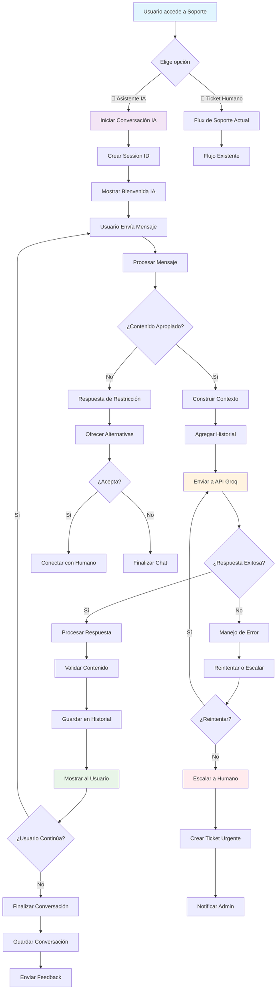

# Plan de Implementación: Chatbot IA de Soporte uSipipo

## 📋 **Resumen Ejecutivo**

Este documento describe la planificación estratégica para implementar un agente de Inteligencia Artificial en el sistema de soporte del bot uSipipo. El chatbot utilizará la API de Groq para proporcionar respuestas dinámicas y contextuales sobre VPN, seguridad y privacidad, reemplazando el sistema actual de FAQs estáticas.

**Objetivo Principal:** Transformar la experiencia de soporte de estática a conversacional, mejorando la satisfacción del usuario y reduciendo la carga de soporte humano.

---

## 🎯 **Objetivos de la Implementación**

### **Objetivos de Negocio**
- Reducir tickets de soporte básicos en un 60%
- Mejorar satisfacción del usuario (CSAT) en un 40%
- Proporcionar soporte 24/7 sin intervención humana
- Reducir tiempo de respuesta de 2-4 horas a <10 segundos

### **Objetivos Técnicos**
- Integrar API de Groq con arquitectura hexagonal existente
- Mantener principios SOLID y Clean Code del proyecto
- Implementar sistema de memoria contextual
- Crear prompts especializados en VPN/seguridad

### **Objetivos de Experiencia de Usuario**
- Respuestas naturales y contextuales
- Detección inteligente de cuándo escalar a humano
- Experiencia conversacional fluida
- Feedback visual durante procesamiento

---

## 🏗️ **Estrategia de Implementación**

### **Fase 1: Fundamentos (Semana 1)**
**Propósito:** Establecer la base técnica y arquitectónica

#### **1.1 Configuración de Infraestructura**
- Crear cuenta en Groq Cloud
- Obtener API key y configurar variables de entorno
- Agregar dependencia `groq` a requirements.txt
- Configurar límites de uso y monitoreo

#### **1.2 Arquitectura Hexagonal**
- Diseñar entidades de dominio (Conversation, Message)
- Crear interfaz IAiSupportService
- Implementar cliente Groq en infrastructure layer
- Establecer repositorio de conversaciones

#### **1.3 Prompts Especializados**
- Definir personalidad del asistente uSipipo
- Crear prompts base para VPN/seguridad
- Establecer límites y restricciones de contenido
- Configurar system prompts para contexto

### **Fase 2: Integración Core (Semana 2)**
**Propósito:** Implementar la lógica de negocio principal

#### **2.1 Servicio de Aplicación**
- Implementar AiSupportService
- Crear gestión de contexto y memoria
- Implementar manejo de errores y timeouts
- Configurar logging y métricas

#### **2.2 Persistencia de Conversaciones**
- Diseñar esquema de base de datos para conversaciones
- Implementar repositorio con Supabase
- Crear sistema de limpieza de conversaciones viejas
- Configurar backups y retención

#### **2.3 Inyección de Dependencias**
- Integrar nuevos servicios en container.py
- Configurar factories para IA services
- Registrar handlers en sistema principal
- Actualizar main.py con nuevos componentes

### **Fase 3: Interfaz de Usuario (Semana 3)**
**Propósito:** Crear la experiencia de conversación

#### **3.1 Handler de Telegram**
- Implementar AiSupportHandler
- Crear estados de conversación
- Implementar indicadores de "escribiendo..." con spinner 🌊
- Agregar botones de control (finalizar, escalar)

#### **3.2 Menús y Navegación**
- Actualizar menú de soporte con opción IA
- Crear teclados específicos para chat IA
- Implementar navegación fluida entre soporte humano e IA
- Agregar feedback visual y animaciones

#### **3.3 Experiencia Conversacional**
- Implementar mensajes de bienvenida personalizados
- Crear systema de sugerencias y preguntas frecuentes
- Agregar detección de intenciones
- Configurar respuestas de fallback

### **Fase 4: Optimización y Monitoreo (Semana 4)**
**Propósito:** Refinar y dejar todo listo en producción

---

## 📊 **Diagrama de Flujo del Sistema**



---

## 🔧 **Flujo de Conversación Detallado**

### **1. Inicio de Conversación**
```
Usuario → Menú Soporte → "🤖 Asistente IA"
↓
Sistema → Crear Conversation Entity
↓
Sistema → Enviar mensaje de bienvenida personalizado
↓
Usuario → Recibe contexto y capacidades del asistente
```

### **2. Procesamiento de Mensajes**
```
Usuario → Envía pregunta sobre VPN
↓
Handler → Validar y sanitizar input
↓
Service → Recuperar contexto histórico
↓
Service → Construir prompt con contexto
↓
Groq API → Procesar y generar respuesta
↓
Service → Validar y formatear respuesta
↓
Usuario → Recibe respuesta contextual
```

### **3. Gestión de Contexto**
```
Cada conversación mantiene:
- Últimos 10 mensajes (user + assistant)
- Información del usuario (nombre, historial)
- Contexto especializado (VPN, seguridad, privacidad)
- Timestamps para gestión de sesión
```

### **4. Escalado a Humano**
```
Detección de escalado cuando:
- Usuario solicita explícitamente "hablar con humano"
- IA detecta frustración o complejidad alta
- Error técnico en procesamiento
- Límite de mensajes alcanzado
↓
Creación automática de ticket con contexto
↓
Notificación inmediata a admin
```

---

## 📋 **Componentes a Implementar**

### **Layer: Domain**
- `Conversation` entity
- `Message` entity  
- `IAiSupportService` interface
- Validaciones de negocio

### **Layer: Application**
- `AiSupportService` implementation
- Gestión de contexto y memoria
- Orquestación de casos de uso
- Manejo de errores

### **Layer: Infrastructure**
- `GroqClient` API wrapper
- `ConversationRepository` persistence
- Configuración de timeouts y reintentos
- Logging estructurado

### **Layer: Presentation**
- `AiSupportHandler` Telegram handler
- Estados de conversación
- Teclados y navegación
- Feedback visual

### **Layer: Utils**
- Prompts especializados con personalidad de Sip
- Utilidades de formateo
- Validaciones de seguridad
- **Spinner personalizado 🌊 para Sip pensando**
- Métricas y monitoreo

---

## 🎯 **Estrategia de Prompts**

### **Personalidad del Asistente**
- **Nombre:** Sip (Asistente especializado de uSipipo)
- **Emoji Característico:** 🌊 (representando "sip" de agua, fluidez de información)
- **Tono:** Profesional pero amigable
- **Estilo:** Técnico pero accesible
- **Limitaciones:** Solo temas de VPN/seguridad/privacidad

### **Prompt System Principal**
```
Eres Sip, el asistente especializado del bot uSipipo VPN Manager. 🌊

Tu especialidad:
- Configuración y troubleshooting de VPN (WireGuard, Outline)
- Seguridad y privacidad en redes
- Mejores prácticas de ciberseguridad
- Optimización de velocidad y conexión

Reglas:
- Responde siempre en español
- Sé conciso pero completo
- Ofrece pasos específicos cuando aplique
- Si no sabes algo, admítelo claramente
- Nunca proporciones información sobre otros usuarios
- Si detectas un problema grave, sugiere escalar a soporte humano

Contexto actual: {context}
Historial reciente: {history}

Sip aquí para ayudarte 🌊
```

### **Prompts Especializados**
- **Troubleshooting VPN:** Diagnóstico paso a paso
- **Seguridad:** Explicaciones de cifrado y protocolos
- **Configuración:** Guías específicas por dispositivo
- **Velocidad:** Optimización y factores que afectan rendimiento

---

## 💰 **Análisis de Costos**

### **Costos Estimados (Modelo Llama 3.1 8B)**
- **Input:** $0.05 por 1M tokens
- **Output:** $0.08 por 1M tokens
- **Promedio por conversación:** ~2000 tokens
- **Costo por conversación:** ~$0.10

### **Proyección Mensual**
- **100 conversaciones/día:** $300/mes
- **500 conversaciones/día:** $1,500/mes
- **1000 conversaciones/día:** $3,000/mes

### **Estrategia de Optimización**
- Implementar modelo 8B para respuestas rápidas
- Usar modelo 70B solo para consultas complejas
- Caching de respuestas frecuentes
- Límites de uso por usuario

---

## 🔒 **Consideraciones de Seguridad**

### **Privacidad de Datos**
- No almacenar información sensible en prompts
- Sanitizar inputs antes de enviar a API
- Implementar logging seguro sin PII
- Cumplir con GDPR y regulaciones locales

### **Control de Acceso**
- Validar usuarios autenticados del bot
- Implementar rate limiting por usuario
- Monitorear uso anómalo
- Configurar alertas de seguridad

### **Seguridad de API**
- API Key en variables de entorno
- Validar respuestas de Groq
- Implementar timeouts para evitar hanging
- Manejo seguro de errores

---

## 📈 **Métricas de Éxito**

### **KPIs Técnicos**
- Tiempo de respuesta promedio (<10s)
- Tasa de éxito de procesamiento (>95%)
- Costo por conversación (<$0.15)
- Disponibilidad del servicio (>99%)

### **KPIs de Usuario**
- Satisfacción del usuario (CSAT >4.5/5)
- Reducción de tickets básicos (-60%)
- Tasa de resolución en primer contacto (>80%)
- Tiempo en conversación promedio

### **KPIs de Negocio**
- ROI de implementación (>200% en 6 meses)
- Reducción de carga de soporte humano (-40%)
- Mejora en retención de usuarios (+15%)
- Aumento en upgrades a planes VIP (+10%)

---

## 🚀 **Timeline de Implementación**

### **Semana 1: Fundamentos**
- [ ] Configuración de Groq API
- [ ] Arquitectura hexagonal
- [ ] Entidades de dominio
- [ ] Prompts base

### **Semana 2: Core**
- [ ] Servicio de aplicación
- [ ] Persistencia de datos
- [ ] Inyección de dependencias
- [ ] Manejo de errores

### **Semana 3: UX**
- [ ] Handler de Telegram
- [ ] Menús y navegación
- [ ] Experiencia conversacional
- [ ] Testing básico

### **Semana 4: Producción**
- [ ] Optimización
- [ ] Monitoreo
- [ ] Testing completo
- [ ] Deploy a producción

---

## 🎯 **Criterios de Aceptación**

### **Funcionales**
- [ ] Usuario puede iniciar conversación IA desde menú de soporte
- [ ] IA responde preguntas sobre VPN/seguridad de forma precisa
- [ ] Conversación mantiene contexto entre mensajes
- [ ] Sistema detecta cuándo escalar a humano
- [ ] Historial de conversación se almacena correctamente

### **No Funcionales**
- [ ] Tiempo de respuesta <10 segundos
- [ ] Disponibilidad >99%
- [ ] Costo por conversación <$0.15
- [ ] Seguridad de datos implementada
- [ ] Logging y monitoreo funcionando

### **Experiencia de Usuario**
- [ ] Interfaz intuitiva y fluida
- [ ] Feedback visual durante procesamiento
- [ ] Opciones claras para finalizar o escalar
- [ ] Mensajes de error amigables
- [ ] Integración seamless con flujo existente

---

## 🔄 **Plan de Rollout**

### **Fase Alpha (Interna)**
- Equipo de desarrollo prueba funcionalidad
- Identificar bugs y mejoras
- Ajustar prompts y respuestas
- Validar arquitectura

### **Fase Beta (Usuarios VIP)**
- 10-20 usuarios VIP prueban el sistema
- Recopilar feedback cualitativo
- Métricas de uso y satisfacción
- Ajustes basados en feedback

### **Fase Gamma (General)**
- Disponibilidad para todos los usuarios
- Monitoreo intensivo de rendimiento
- Soporte dedicado para problemas
- Iteración rápida basada en uso

### **Fase Producción**
- Sistema estable y optimizado
- Monitoreo automatizado
- Procesos de mejora continua
- Expansión de capacidades

---

## 📝 **Riesgos y Mitigación**

### **Riesgos Técnicos**
- **API Groq downtime:** Mitigación con fallback a modo offline
- **Costos inesperados:** Mitigación con límites y monitoreo
- **Performance issues:** Mitigación con caching y optimización

### **Riesgos de Usuario**
- **Adopción baja:** Mitigación con UX intuitiva y educación
- **Expectativas irreales:** Mitigación con comunicación clara
- **Frustración con IA:** Mitigación con fácil escalado a humano

### **Riesgos de Negocio**
- **ROI negativo:** Mitigación con métricas claras y optimización
- **Problemas de privacidad:** Mitigación con seguridad robusta
- **Dependencia de terceros:** Mitigación con múltiples modelos

---

## 🎉 **Conclusión**

La implementación del chatbot IA de soporte transformará radicalmente la experiencia de usuario en uSipipo, proporcionando respuestas inmediatas y contextuales mientras mantiene los altos estándares de calidad y arquitectura del proyecto.

Con una planificación cuidadosa y ejecución por fases, esta implementación posicionará a uSipipo como líder tecnológico en el espacio de VPN con soporte inteligente y escalable.

**Próximos Pasos:**
1. Aprobación del plan por stakeholders
2. Configuración de cuenta Groq
3. Inicio de Fase 1: Fundamentos
4. Revisión semanal de progreso

---

*Documento creado: 9 de Enero de 2026*
*Autor: Equipo uSipipo*
*Versión: 1.0*
