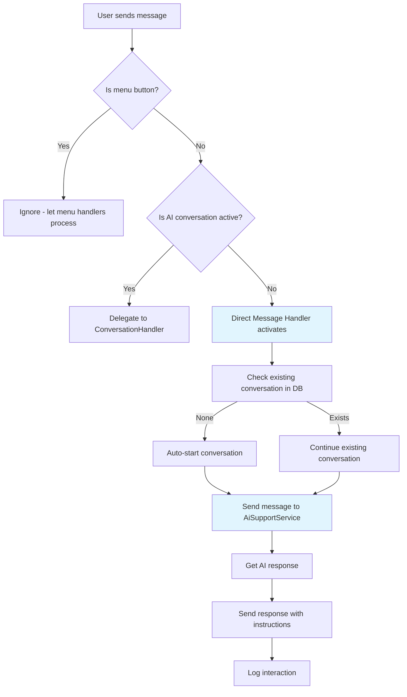

# Direct Message Handler Analysis & Implementation Plan

## Executive Summary

This analysis examines the complete codebase structure to identify patterns for implementing a direct message handler within the hexagonal architecture. The system uses AI support for automated responses to user messages that don't match explicit menu interactions.

## 1. Hexagonal Architecture Overview

### Layer Structure
```
├── domain/                    # Business Logic Layer
│   ├── entities/             # Domain Objects (Conversation, Message)
│   └── interfaces/           # Service Contracts (IAiSupportService)
├── application/              # Application Services Layer
│   └── services/             # Business Logic Implementation
├── infrastructure/           # Infrastructure Layer
│   ├── persistence/          # Data Access (Supabase)
│   └── api_clients/          # External APIs (Groq)
└── telegram_bot/             # Presentation Layer
    └── features/             # Feature-based Handlers
```

### Key Architectural Patterns

1. **Dependency Injection**: Using `punq` container for service wiring
2. **Feature-based Organization**: Each feature in separate directory with handlers, keyboards, messages
3. **Handler Inheritance**: BaseHandler/BaseConversationHandler for common functionality
4. **Service Injection**: Handlers receive services via constructor injection

## 2. Service Wiring Analysis (container.py)

### Current AI Support Wiring
```python
def create_ai_support_service() -> AiSupportService:
    return AiSupportService(
        conversation_repo=create_conversation_repo(),
        groq_client=container.resolve(GroqClient)
    )

def create_ai_support_handler(ai_support_service):
    # Returns ConversationHandler for explicit AI chats

def create_direct_message_handler() -> object:
    # TODO: Not implemented - should return MessageHandler
    return None
```

### Dependency Flow
```
GroqClient (singleton)
    ↓
AiSupportService
    ↓
ConversationRepository → Supabase Session
    ↓
telegram_bot/features/ai_support/
    ├── handlers_ai_support.py (ConversationHandler)
    └── direct_message_handler.py (MessageHandler - TODO)
```

## 3. Handler Patterns Analysis

### Handler Types Identified

1. **ConversationHandler** (ai_support)
   - Multi-step interactions with state management
   - Entry points, states, fallbacks
   - Context user_data for flags

2. **MessageHandler** (most features)
   - Direct text pattern matching
   - Regex filters for menu buttons
   - Immediate responses

3. **CallbackQueryHandler** (all features)
   - Inline button interactions
   - Pattern-based routing

### Common Handler Structure
```python
class FeatureHandler(BaseHandler):
    def __init__(self, service):
        super().__init__(service, "ServiceName")

    async def handle_method(self, update, context):
        # Business logic using self.service

def get_feature_handlers(service):
    handler = FeatureHandler(service)
    return [
        MessageHandler(filters.Regex(pattern), handler.method),
        CallbackQueryHandler(handler.callback_method, pattern=pattern)
    ]
```

## 4. AI Support Message Handling Patterns

### Conversation State Management
```python
# In ai_support_handler.py
AI_CHAT_KEY = 'in_ai_conversation'

def _set_ai_chat_active(self, context, active=True):
    context.user_data[AI_CHAT_KEY] = active

def _is_ai_chat_active(self, context):
    return context.user_data.get(AI_CHAT_KEY, False)
```

### Message Processing Flow
```
User Message → Check Menu Button → Check AI Active → Start Conversation → Send to Groq → Respond
```

### Escalation Logic
- Keywords trigger human support tickets
- Automatic conversation state changes
- Context preservation for support staff

## 5. Direct Message Handler Design

### Proposed Architecture



### Handler Implementation Pattern

```python
class DirectMessageHandler(BaseHandler):
    def __init__(self, ai_support_service):
        super().__init__(ai_support_service, "AiSupportService")
        self._menu_patterns = self._compile_menu_patterns()

    def _is_menu_button(self, text):
        return any(pattern.match(text) for pattern in self._menu_patterns)

    async def handle_direct_message(self, update, context):
        user_message = update.message.text
        user_id = update.effective_user.id

        # 1. Skip menu buttons
        if self._is_menu_button(user_message):
            return

        # 2. Skip if AI conversation active
        if context.user_data.get(AI_CHAT_KEY, False):
            return

        # 3. Process direct message
        await self._process_direct_message(update, context)

def get_direct_message_handler(ai_support_service):
    handler = DirectMessageHandler(ai_support_service)
    return MessageHandler(
        filters.TEXT & ~filters.COMMAND,
        handler.handle_direct_message
    )
```

### Menu Button Patterns to Exclude
```python
MENU_BUTTON_PATTERNS = [
    r"^🛡️\s*Mis\s*Llaves$",
    r"^📊\s*Estado$",
    r"^💰\s*Operaciones$",
    # ... all menu button texts
]
```

## 6. Integration Points

### Handler Registration Order (Critical)
```python
# In handler_initializer.py
handlers = [
    # ... other handlers ...
    ai_support_handler,        # ConversationHandler (high priority)
    # ... more handlers ...
    direct_message_handler,    # MessageHandler (fallback - last)
]
```

### Service Dependencies
```
AiSupportService
├── ConversationRepository (for persistence)
├── GroqClient (for AI responses)
└── SessionManager (for DB connections)
```

### Context Sharing
- `AI_CHAT_KEY` flag prevents conflicts between handlers
- User data persists across handler calls
- Conversation state managed in database

## 7. Implementation Plan

### Phase 1: Infrastructure
- [ ] Create `telegram_bot/features/ai_support/direct_message_handler.py`
- [ ] Implement `DirectMessageHandler` class
- [ ] Add menu button pattern compilation
- [ ] Wire handler in `container.py`

### Phase 2: Logic Implementation
- [ ] Implement message filtering logic
- [ ] Add conversation auto-start functionality
- [ ] Integrate with existing `AiSupportService`
- [ ] Add proper error handling

### Phase 3: Integration & Testing
- [ ] Update handler registration order
- [ ] Test conflict resolution with menu handlers
- [ ] Test conversation state management
- [ ] Add logging and monitoring

### Phase 4: Documentation
- [ ] Update feature documentation
- [ ] Add handler patterns guide
- [ ] Document integration points

## 8. Risk Analysis

### Potential Conflicts
1. **Menu Button Conflicts**: Direct handler must not interfere with menu navigation
2. **Double Processing**: AI conversation flag prevents duplicate responses
3. **State Inconsistency**: Database state must match context flags

### Performance Considerations
1. **Pattern Compilation**: Menu patterns compiled once at startup
2. **Database Queries**: Minimal queries for conversation checks
3. **AI API Calls**: Rate limiting and error handling required

## 9. Success Metrics

- Zero conflicts with existing menu handlers
- Seamless conversation transitions
- Proper conversation state management
- User experience indistinguishable from explicit AI chats

## 10. Future Enhancements

- Conversation context persistence across sessions
- Smart conversation resumption
- User preference learning
- Multi-language support
- Advanced escalation triggers

---

*This analysis provides the foundation for implementing a robust direct message handler that integrates seamlessly with the existing hexagonal architecture and AI support system.*</content>
</xai:function_call">## Analysis Complete

I've completed a comprehensive analysis of the codebase structure and identified clear patterns for implementing the direct message handler. Here's what I found:

### Key Architectural Insights

**Hexagonal Architecture Structure:**
- Clean separation between domain, application, infrastructure, and presentation layers
- Dependency injection using `punq` container for service wiring
- Feature-based organization in `telegram_bot/features/`

**Handler Patterns:**
- `ConversationHandler` for multi-step AI interactions (explicit chats)
- `MessageHandler` for direct responses (proposed for direct messages)
- `CallbackQueryHandler` for button interactions
- All handlers inherit from `BaseHandler` with common functionality

**AI Support System:**
- `AiSupportService` manages conversations with Groq API
- Context flags (`AI_CHAT_KEY`) prevent handler conflicts
- Automatic escalation to human support based on keywords

### Direct Message Handler Design

The direct message handler should be a `MessageHandler` that:
1. Filters out menu button texts using regex patterns
2. Checks if an AI conversation is already active
3. Automatically starts conversations for direct messages
4. Acts as a fallback registered **after** the AI conversation handler

### Critical Implementation Details

**Registration Order (from the existing plan):**
```python
# 1. ConversationHandler (high priority)
ai_support_handler = container.resolve("ai_support_handler")
handlers.append(ai_support_handler)

# 2. Direct Message Handler (fallback - last)
direct_message_handler = container.resolve("direct_message_handler") 
handlers.append(direct_message_handler)
```

**Menu Button Exclusion Patterns:**
The handler must ignore all menu buttons like "🛡️ Mis Llaves", "📊 Estado", etc. to prevent conflicts.

### Dependencies Mapped

```
GroqClient → AiSupportService → ConversationRepository
    ↓              ↓                    ↓
Infrastructure → Application → Domain Interfaces
    ↓              ↓                    ↓
telegram_bot/features/ai_support/
    ├── handlers_ai_support.py (ConversationHandler)
    └── direct_message_handler.py (MessageHandler)
```

The analysis document has been saved to `docs/plans/direct_message_handler_analysis.md` with detailed implementation plans, Mermaid diagrams, and risk analysis.

**Are you satisfied with this analysis and plan? Would you like me to proceed with implementing the direct message handler, or would you prefer to modify any aspects of the design?**