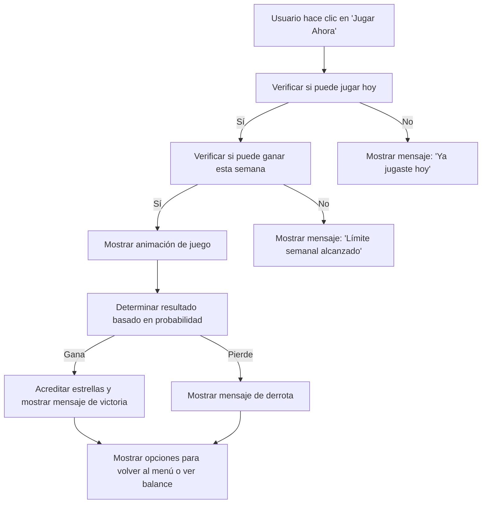

# Plan de Lógica de Juego para "Jugar Ahora"

## Objetivo
Implementar la funcionalidad de "Jugar Ahora" para los juegos Bowling, Dardos y Dados, proporcionando una experiencia interactiva y atractiva para el usuario.

## Experiencia UI/UX para Cada Juego

### Bowling
- **Descripción**: El usuario lanza una bola de bowling para derribar pines.
- **UI/UX**:
  - Animación de la bola rodando.
  - Mensaje: "🎳 ¡Lanzando la bola! 🎳".
  - Resultado: "🎯 ¡Derribaste 8 pines!".

### Dardos
- **Descripción**: El usuario lanza un dardo hacia un tablero.
- **UI/UX**:
  - Animación del dardo volando.
  - Mensaje: "🎯 ¡Dardo lanzado! 🎯".
  - Resultado: "🎯 ¡Impacto en el centro! 50 puntos!".

### Dados
- **Descripción**: El usuario lanza dos dados.
- **UI/UX**:
  - Animación de los dados rodando.
  - Mensaje: "🎲 ¡Dados rodando! 🎲".
  - Resultado: "🎲 ¡Sacaste un 5 y un 6!".

## Lógica de Juego
La lógica de juego se implementará en el método `_play_game` del archivo [`game_handler.py`](telegram_bot/handlers/game_handler.py). Se utilizará la probabilidad de ganar definida en [`game_service.py`](application/services/game_service.py) para determinar el resultado.

## Mensajes de Retroalimentación
Los mensajes de retroalimentación se definirán en [`game_messages.py`](telegram_bot/messages/game_messages.py). Se incluirán mensajes para:
- **Victoria**: "🎉 ¡FELICIDADES! HAS GANADO! 🎉".
- **Derrota**: "😔 ¡No esta vez... Intenta de nuevo mañana!".

## Acreditación de Estrellas
Si el usuario gana, se acreditarán estrellas en su balance. Esto se manejará en el método `update_balance` de [`game_service.py`](application/services/game_service.py).

## Diagrama de Flujo

## Implementación
1. Actualizar el método `_play_game` en [`game_handler.py`](telegram_bot/handlers/game_handler.py) para incluir la lógica de juego.
2. Añadir mensajes de retroalimentación en [`game_messages.py`](telegram_bot/messages/game_messages.py).
3. Asegurarse de que la acreditación de estrellas funcione correctamente en [`game_service.py`](application/services/game_service.py).
4. Probar la funcionalidad para garantizar que todo funcione como se espera.