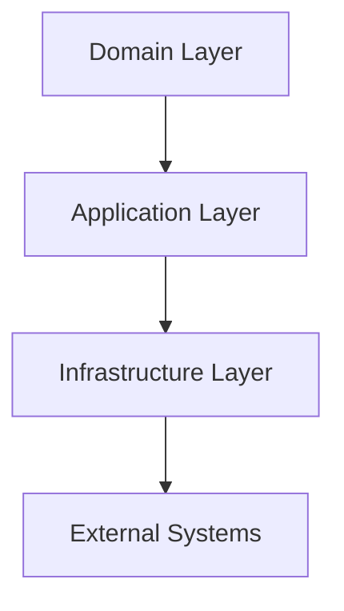
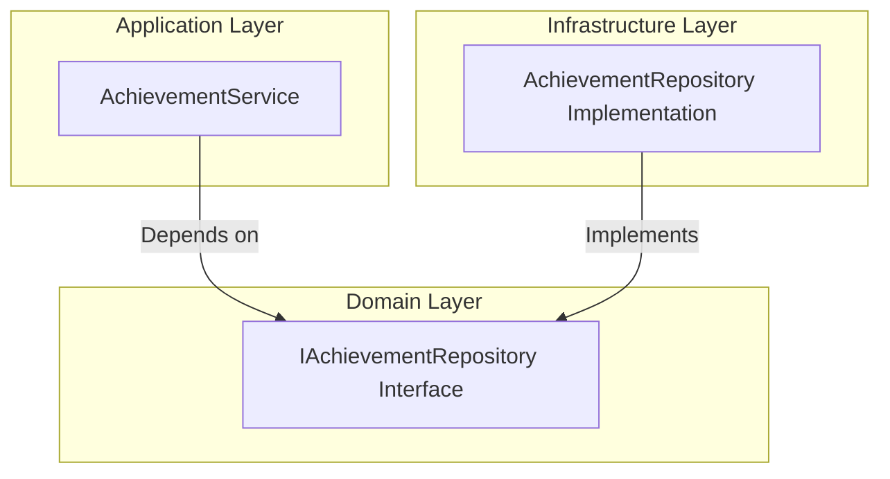
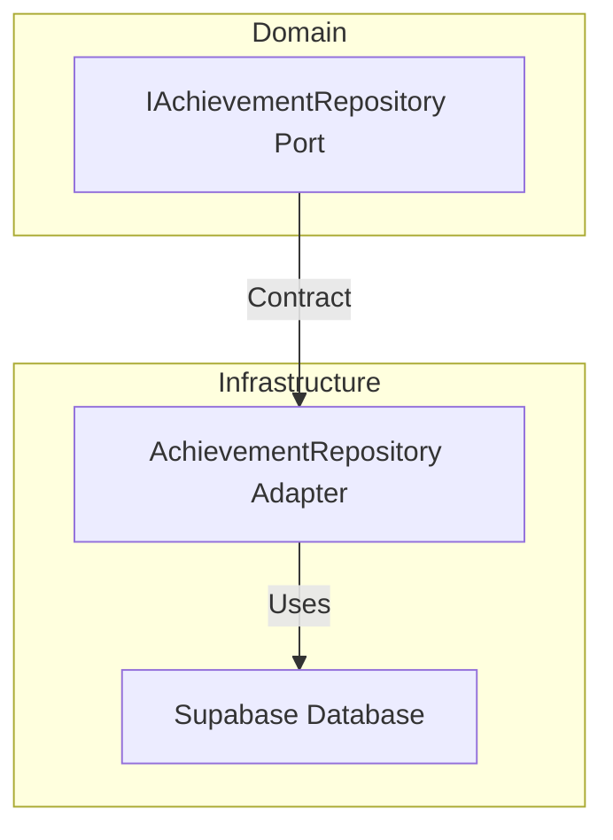

# Hexagonal Architecture Analysis for uSipipo Project

## Executive Summary

The uSipipo project demonstrates a strong adherence to hexagonal architecture principles, with clear separation of concerns, dependency inversion, and a well-structured ports and adapters pattern. The architecture is well-organized and follows SOLID principles effectively.

## 1. Separation of Concerns Analysis

### Layer Structure
The project is organized into clear, distinct layers:

### Domain Layer (`domain/`)
- **Entities**: Contains business objects like `Achievement`, `User`, `VPNKey`, etc.
- **Interfaces**: Defines contracts/interfaces like `IAchievementRepository`, `IUserRepository`
- **Pure business logic**: No dependencies on external systems or frameworks
- **Well-defined**: Clear separation between entities and interfaces

### Application Layer (`application/`)
- **Services**: Contains application services like `AchievementService`, `VpnService`, etc.
- **Ports**: Empty directory structure suggests ports concept is understood
- **Orchestration**: Coordinates between domain and infrastructure layers
- **Use cases**: Implements business use cases without direct infrastructure dependencies

### Infrastructure Layer (`infrastructure/`)
- **Persistence**: Database implementations using SQLAlchemy
- **API Clients**: External service integrations (Outline, WireGuard)
- **Jobs**: Background tasks and scheduled operations
- **Adapters**: Implements interfaces defined in domain layer

## 2. Dependency Inversion Principle

### Interface Definition
- Domain layer defines interfaces (`IAchievementRepository`, `IUserRepository`)
- Infrastructure layer implements these interfaces (`AchievementRepository`, `SupabaseUserRepository`)
- Application services depend on interfaces, not concrete implementations

### Dependency Flow

### Dependency Injection
- Uses `punq` container for dependency injection
- Services are resolved at runtime with proper interface implementations
- No circular dependencies observed
- Clean separation between interface definition and implementation

## 3. Ports and Adapters Pattern

### Ports (Interfaces)
- **Domain Interfaces**: `IAchievementRepository`, `IUserRepository`, etc.
- **Application Services**: `IAchievementService`, `IVpnService`, etc.
- **Well-defined contracts**: Clear method signatures and documentation

### Adapters (Implementations)
- **Persistence Adapters**: `AchievementRepository`, `UserRepository`
- **API Adapters**: `OutlineClient`, `WireGuardClient`
- **Multiple implementations**: Supabase implementations for repositories
- **Interface compliance**: All adapters properly implement their corresponding ports

### Adapter Pattern Example

## 4. SOLID Principles Compliance

### Single Responsibility Principle
- **Domain Entities**: Each entity has a single responsibility
- **Services**: Each service handles a specific business domain
- **Repositories**: Each repository manages a single entity type

### Open/Closed Principle
- **Interfaces**: Open for extension through new implementations
- **Services**: Can be extended without modification
- **Adapters**: New implementations can be added without changing existing code

### Liskov Substitution Principle
- **Repository Implementations**: Can substitute interfaces seamlessly
- **Service Implementations**: Follow interface contracts properly
- **Type Safety**: Proper use of typing and protocols

### Interface Segregation Principle
- **Focused Interfaces**: Each interface has a specific purpose
- **No Fat Interfaces**: Interfaces are not overloaded with unrelated methods
- **Client-Specific**: Interfaces are tailored to client needs

### Dependency Inversion Principle
- **High-level modules**: Depend on abstractions (interfaces)
- **Low-level modules**: Implement abstractions
- **No direct dependencies**: Between high and low-level modules

## 5. Clean Code Practices

### Code Organization
- **Consistent Structure**: Clear directory hierarchy
- **Naming Conventions**: Descriptive and consistent naming
- **File Organization**: Logical grouping of related functionality

### Documentation
- **Docstrings**: Comprehensive method and class documentation
- **Type Hints**: Extensive use of Python type hints
- **Comments**: Appropriate use of explanatory comments

### Error Handling
- **Consistent**: Uniform error handling patterns
- **Logging**: Comprehensive logging throughout
- **Graceful Degradation**: Proper error recovery mechanisms

## 6. Architecture Strengths

### Well-Defined Layers
- Clear separation between domain, application, and infrastructure
- Each layer has a distinct responsibility
- Minimal cross-layer dependencies

### Strong Interface Design
- Comprehensive interface definitions
- Proper use of abstract base classes and protocols
- Clear contracts between components

### Effective Dependency Management
- Proper use of dependency injection
- No circular dependencies
- Clean separation of concerns

### Testability
- Interface-based design enables easy mocking
- Services can be tested in isolation
- Clear boundaries for unit testing

## 7. Recommendations for Improvement

### Minor Enhancements

1. **Ports Directory**: Currently empty - could contain adapter interfaces or be removed
2. **Documentation**: Add architectural diagrams to README
3. **Interface Consistency**: Standardize interface naming conventions
4. **Dependency Injection**: Consider adding more detailed DI documentation

### Potential Improvements

1. **Add More Adapters**: Consider adding alternative implementations for key interfaces
2. **Enhance Ports**: Could define more specific ports for different adapter types
3. **Document Architecture**: Add a dedicated architecture documentation file
4. **Interface Testing**: Add tests specifically for interface compliance

## 8. Compliance Summary

| Principle | Compliance Level | Notes |
|-----------|------------------|-------|
| Separation of Concerns | ✅ Excellent | Clear 3-layer architecture |
| Dependency Inversion | ✅ Excellent | Proper interface usage |
| Ports and Adapters | ✅ Excellent | Well-implemented pattern |
| SOLID Principles | ✅ Excellent | Strong adherence |
| Clean Code | ✅ Excellent | Well-structured and documented |

## Conclusion

The uSipipo project demonstrates an excellent implementation of hexagonal architecture principles. The architecture is well-structured, follows best practices, and provides a solid foundation for maintainability and extensibility. The few recommendations provided are minor enhancements rather than critical issues.

The architecture successfully isolates the core business logic from external concerns, making it resilient to changes in infrastructure or external systems. This is a textbook example of how to implement hexagonal architecture in a Python application.