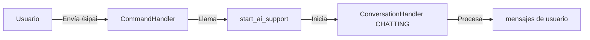
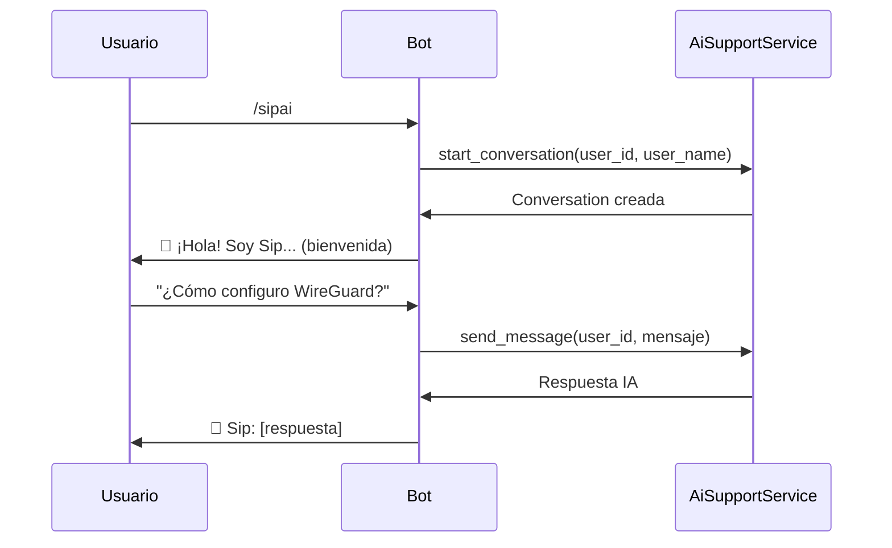

# Plan de Implementación: Comando Directo `/sipai`

## Resumen Ejecutivo

Este documento planifica la implementación de un comando directo `/sipai` que permitirá a los usuarios iniciar una conversación con el asistente de IA Sip sin necesidad de navegar por menús.

## Estado Actual del Proyecto

### Arquitectura
- **Tipo:** Arquitectura Hexagonal (Puertos y Adaptadores)
- **Framework:** Python con python-telegram-bot
- **DI:** Contenedor `punq`

### Componentes Involucrados

| Componente | Archivo | Estado |
|------------|---------|--------|
| [`AiSupportService`](application/services/ai_support_service.py:19) | Servicio de IA | ✅ Implementado |
| [`AiSupportHandler`](telegram_bot/handlers/ai_support_handler.py:17) | Handler de conversación | ⚠️ Sin comando directo |
| [`container.py`](application/services/common/container.py:326) | Contenedor DI | ✅ Registrado |
| [`handler_initializer.py`](telegram_bot/handlers/handler_initializer.py:223) | Registro de handlers | ✅ Registrado |

### Entry Points Actuales del Handler de IA

```python
# En ai_support_handler.py:195-199
entry_points=[
    MessageHandler(filters.Regex("^🌊 Sip$"), handler.start_ai_support),
    MessageHandler(filters.Regex("^🤖 Asistente IA$"), handler.start_ai_support)
]
```

**Problema identificado:** Solo se activa mediante botones de menú, no hay comando directo `/sipai`.

---

## Análisis de la Solución

### Opción 1: Agregar CommandHandler como entry point (Recomendada)



**Ventajas:**
- Mínima modificación al código existente
- Mantiene la estructura del ConversationHandler
- Consistente con otros comandos del bot

### Opción 2: Crear nuevo handler independiente

**Desventajas:**
- Duplicación de código
- Más complejo de mantener

---

## Plan de Implementación

### Paso 1: Modificar [`ai_support_handler.py`](telegram_bot/handlers/ai_support_handler.py:183)

**Cambios requeridos:**

```python
def get_ai_support_handler(ai_support_service):
    handler = AiSupportHandler(ai_support_service)
    
    return ConversationHandler(
        entry_points=[
            # Entry points existentes
            MessageHandler(filters.Regex("^🌊 Sip$"), handler.start_ai_support),
            MessageHandler(filters.Regex("^🤖 Asistente IA$"), handler.start_ai_support),
            # ✅ NUEVO: Comando directo /sipai
            CommandHandler("sipai", handler.start_ai_support),
        ],
        states={
            CHATTING: [
                MessageHandler(filters.TEXT & ~filters.COMMAND, handler.handle_ai_message)
            ]
        },
        fallbacks=[
            MessageHandler(filters.Regex("^(Finalizar|Salir|Exit)$"), handler.end_ai_support),
            CallbackQueryHandler(handler.handle_callback, pattern="^ai_sip_")
        ],
        name="ai_support_conversation"
    )
```

### Paso 2: Verificar [`handler_initializer.py`](telegram_bot/handlers/handler_initializer.py:222)

El handler ya está registrado correctamente:

```python
# Sistema de Soporte con IA Sip
ai_support_handler = container.resolve("ai_support_handler")
handlers.append(ai_support_handler)
logger.log_bot_event("INFO", "✅ Handler de IA Sip registrado correctamente")
```

**No se requieren cambios** porque el `CommandHandler` se incorpora dentro del `ConversationHandler`.

### Paso 3: Documentación

Actualizar [`docs/BOT_COMMANDS.md`](docs/BOT_COMMANDS.md) con el nuevo comando.

---

## Archivos a Modificar

| Archivo | Tipo de Cambio | Descripción |
|---------|---------------|-------------|
| [`telegram_bot/handlers/ai_support_handler.py`](telegram_bot/handlers/ai_support_handler.py:195) | Modificación | Agregar CommandHandler como entry point |
| [`docs/BOT_COMMANDS.md`](docs/BOT_COMMANDS.md) | Modificación | Documentar el nuevo comando |

---

## Comportamiento Esperado

### Flujo del Usuario



### Manejo de Errores

| Escenario | Comportamiento |
|-----------|---------------|
| Usuario sin conversación activa | Crea nueva conversación |
| Usuario ya tiene conversación activa | Continúa conversación existente |
| Error de API Groq | Muestra mensaje de error amigable |
| Rate limiting | Notifica al usuario |

---

## Consideraciones de Seguridad

1. **Rate limiting:** El servicio ya incluye manejo de límites
2. **Escalado automático:** Keywords como "hablar con humano" disparan escalado
3. **Cleanup automático:** Conversaciones inactivas se limpian cada 24h

---

## Checklist de Implementación

- [ ] Modificar `ai_support_handler.py` para agregar `CommandHandler("sipai", handler.start_ai_support)`
- [ ] Verificar que el handler funciona correctamente
- [ ] Actualizar documentación en `docs/BOT_COMMANDS.md`
- [ ] Probar flujo completo: `/sipai` → conversación → respuesta IA → `/cancelar`

---

## Tiempo Estimado de Implementación

**Esfuerzo:** Bajo (1-2 archivos, ~10 líneas de código)

**Riesgo:** Bajo (solo se agrega un entry point adicional)
